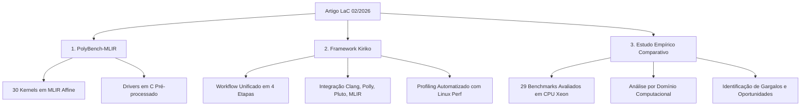
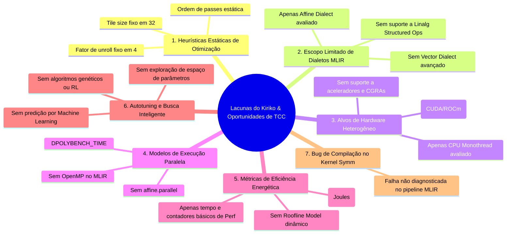

# 📄 Análise Técnica Aprofundada — Relatório Técnico LaC (02/2026)

> **Artigo Analisado:** *An MLIR Version of the PolyBench Benchmark Suite for High-Performance Computing*  
> **Autores:** Lucas Victor Costa (Cadence), José Wesley Magalhães (Cadence), Michael Canesche (Cadence), Fernando Pereira (DCC/UFMG)  
> **Data:** Fevereiro de 2026  
> **Repositório Oficial:** [github.com/lac-dcc/Kiriko](https://github.com/lac-dcc/Kiriko)  
> **Licença:** Apache 2.0  

---

## 1. Contexto & Problema de Pesquisa

### 1.1. A Importância da Otimização Poliédrica em HPC
Aplicações de Computação de Alto Desempenho (HPC), aprendizado profundo e processamento científico dependem criticamente do desempenho de laços aninhados (*nested loops*), que consomem a maior parte dos ciclos de processamento de kernels lineares, estênceis e mineração de dados. O **Modelo Poliédrico** (*Polyhedral Model*) é a estrutura matemática mais robusta para analisar e transformar laços estáticos, permitindo transformações complexas como *loop tiling* (bloqueio de cache), *loop fusion/fission*, *interchange*, *skewing* e *parallelization*.

### 1.2. A Fragmentação do Ecossistema
Apesar de sua relevância teórica e prática, as ferramentas poliédricas consagradas operam em silos incompatíveis:
1. **Pluto:** Otimizador *source-to-source* baseado em C com representação OpenScop/Cloog.
2. **LLVM Polly:** Subprojeto do LLVM que intercepta a Representação Intermediária (LLVM IR) e aplica transformações via biblioteca ISL (*Integer Set Library*).
3. **MLIR Affine Dialect:** Dialeto moderno de representação intermediária em múltiplos níveis (LLVM/MLIR) que modela laços afins nativamente através de operações como `affine.for`, `affine.load`, `affine.store` e mapas afins (`affine_map`).

Essa heterogeneidade cria um gargalo histórico: **cada ferramenta exigia seu próprio formato de entrada, pipeline de compilação e infraestrutura de teste, tornando comparações justas e reprodutíveis extremamente difíceis**.

### 1.3. O Desafio da Ausência de PolyBench Nativo em MLIR
Embora o **PolyBench/C 3.2** (Pouchet et al.) seja o benchmark padrão *de facto* para compiladores poliédricos, não existia uma versão nativa e padronizada em MLIR. Ferramentas automáticas de levantamento (*C-to-MLIR raising*) como o **Polygeist** falham em gerar código Affine consistente sem intervenção humana, exigindo:
- Expansão completa de diretivas de pré-processador e macros de alocação de memória.
- Normalização manual de expressões de índices de laços.
- Refinamento estrutural de `memref` e tipos de dados para compatibilidade com o pipeline de lowering do MLIR.

---

## 2. Contribuições Principais do Trabalho

O relatório técnico apresenta três contribuições fundamentais para a comunidade de compiladores:



1. **PolyBench-MLIR:** Versão completa e validada dos 30 kernels do PolyBench 3.2 reescritos no dialeto **MLIR Affine**, acompanhados de drivers em C pré-processados (`<kernel>_prep_mlir.c` e `<kernel>_prep_c.c`) para garantir geração de entrada, medição de tempo e verificação de corretude idênticas.
2. **Kiriko:** Framework automatizado e extensível que integra múltiplos compiladores em uma esteira única de compilação, lowering, linking, execução e coleta de métricas de hardware via Linux Perf.
3. **Avaliação Empírica Rigorosa:** Comparação direta de Clang (-O0 a -O3), LLVM Polly, Pluto e MLIR Affine em 29 benchmarks e 5 domínios computacionais.

---

## 3. Arquitetura do Framework Kiriko

O Kiriko desacopla o processo de benchmarking em 4 estágios bem delimitados:

```mermaid
sequenceDiagram
    participant Source as Fonte (C ou MLIR)
    participant Opt as 1. Kernel Optimization
    participant Low as 2. Lowering & Object Gen
    participant Build as 3. Benchmark Construction
    participant Eval as 4. Execution & Profiling

    alt Pipeline MLIR Affine
        Source->>Opt: <kernel>_kernel.mlir
        Opt->>Opt: mlir-opt (opt_pipeline: tile, fusion, unroll, scalrep, vectorize)
        Opt->>Low: opt_affine_<kernel>.mlir
        Low->>Low: mlir-opt (lowering_pipeline: lower-affine, to-llvm)
        Low->>Low: mlir-translate (--mlir-to-llvmir) -> llc (-O3) -> <kernel>_mlir.o
    else Pipeline Polly
        Source->>Opt: <kernel>_kernel.c
        Opt->>Low: clang -O3 -mllvm -polly -c -> <kernel>_kernel_O3_mllvm_polly.o
    else Pipeline Pluto
        Source->>Opt: <kernel>_kernel.c
        Opt->>Opt: pluto polycc -> <kernel>_kernel_pluto.c
        Opt->>Low: clang -O0 -c -> <kernel>_kernel_pluto.o
    else Baseline Clang (-O0..-O3)
        Source->>Opt: <kernel>_kernel.c
        Opt->>Low: clang -Ox -c -> <kernel>_kernel_Ox.o
    end

    Low->>Build: Arquivo Objeto do Kernel (.o) + Driver Pré-processado (<kernel>_prep.c)
    Build->>Build: Clang -O0 -DPOLYBENCH_TIME -lm polybench.c -> Executável Final
    Build->>Eval: Executável Final
    Eval->>Eval: 30 Execuções por Ferramenta + Linux Perf Stat -> CSV de Métricas
```

### 3.1. Pipeline de Otimização MLIR Atual (no código de `compile_mlir.py`)
No Kiriko v1.0, o pipeline padrão do MLIR é configurado com a seguinte sequência de passes estáticos:
```python
opt_pipeline = [
    "-canonicalize",
    "-cse",
    "-mem2reg",
    "-affine-loop-tile=tile-size=32",
    "-affine-loop-fusion",
    "-affine-loop-unroll=unroll-factor=4",
    "-affine-loop-coalescing",
    "-affine-loop-invariant-code-motion",
    "-affine-scalrep",
    "-affine-super-vectorize"
]
```
E o pipeline de lowering:
```python
lowering_pipeline = [
    "--lower-affine",
    "--convert-scf-to-cf",
    "--convert-cf-to-llvm",
    "--convert-math-to-funcs",
    "--convert-math-to-llvm",
    "--convert-arith-to-llvm",
    "--convert-func-to-llvm",
    "--finalize-memref-to-llvm",
    "-reconcile-unrealized-casts"
]
```

---

## 4. Síntese dos Resultados Experimentais

### 4.1. Configuração do Experimento
- **Processador:** Intel Xeon E5-2680 v2 @ 2.80 GHz (20 núcleos físicos, 40 threads, 50 MiB L3 Cache).
- **Memória:** 32 GB DDR3 @ 1333 MT/s.
- **SO & Versões:** Ubuntu 20.04 LTS, Clang/LLVM 20.1, Polly 20.1, Pluto 0.13.0, MLIR 20.1.
- **Amostragem:** $N = 30$ execuções consecutivas por par $\langle \text{kernel}, \text{ferramenta} \rangle$.
- **Baseline de Normalização:** `Clang -O0`.

### 4.2. Resultados por Domínio Computacional (Speedup Geomean)

| Categoria / Domínio | Clang -O3 | LLVM Polly | MLIR Affine | Pluto | Destaque do Domínio |
| :--- | :---: | :---: | :---: | :---: | :--- |
| **Geral (Suite Completa)** | **2.192×** | **1.968×** | **1.779×** | **0.994×** | Clang -O3 tem maior geomean geral; Polly é 2º; MLIR supera Pluto. |
| **Linear Algebra Kernels** | **2.125×** | 1.493× | **1.604×** | 0.909× | MLIR supera Polly; Clang -O3 lidera em 2mm, atax, bicg, doitgen. |
| **Linear Algebra Solvers** | 1.967× | **2.402×** | 1.770× | 1.140× | **Polly domina** (destaque em `lu` e `gramschmidt`). |
| **Medley** | **7.771×** | 1.665× | **4.495×** | 0.671× | MLIR atinge 4.5× (`reg_detect`); Pluto sofre degradação severa. |
| **Stencils** | **2.550×** | 1.494× | **2.291×** | 0.729× | **MLIR Affine é altamente competitivo** em `fdtd-2d`, `jacobi-1d`, `jacobi-2d`. |
| **Datamining** | 0.912× | **5.261×** | 0.888× | **3.852×** | **Polly (5.26×) e Pluto (3.85×) dominam**; Clang e MLIR degradam (< 1.0×). |

### 4.3. O Caso Extremo do GEMM
O benchmark `gemm` foi omitido do gráfico principal do artigo devido a variações extremas:
- **LLVM Polly:** **26.98×** (graças ao pattern-matching de matrizes BLAS e reordenação ótima de laços no ISL).
- **Pluto:** **1.72×**
- **Clang -O3:** **1.045×**
- **MLIR Affine:** **0.97×** (sem autotuning do tamanho de bloco, o `tile-size=32` fixo causou overhead de controle e conflito de cache).

### 4.4. A Exclusão do Kernel `symm`
O benchmark `symm` (Symmetric Matrix-Matrix Multiplication) foi excluído do estudo devido a uma **corrupção/falha de compilação no pipeline do MLIR Affine**. Isso representa uma oportunidade imediata de investigação e correção.

---

## 5. Lacunas Críticas Identificadas no Artigo & Oportunidades de TCC

Ao analisar criticamente as limitações do estado atual do Kiriko e do PolyBench-MLIR, identificam-se **7 lacunas fundamentais**:



---

## 6. Conclusão da Análise

O relatório técnico do LaC/Cadence estabelece uma **fundação inédita e sólida** ao disponibilizar o PolyBench-MLIR e o framework Kiriko. Contudo, o pipeline de otimização MLIR avaliado é apenas uma prova de conceito básica (parâmetros fixos, execução sequencial em CPU única, apenas dialeto Affine).

Essa base oferece o **terreno perfeito para um TCC de excelência na UFMG**, permitindo que o estudante explore autotuning, dialetos modernos (`linalg`, `gpu`, `vector`), paralelismo multinúcleo e aceleração em hardware heterogêneo.
