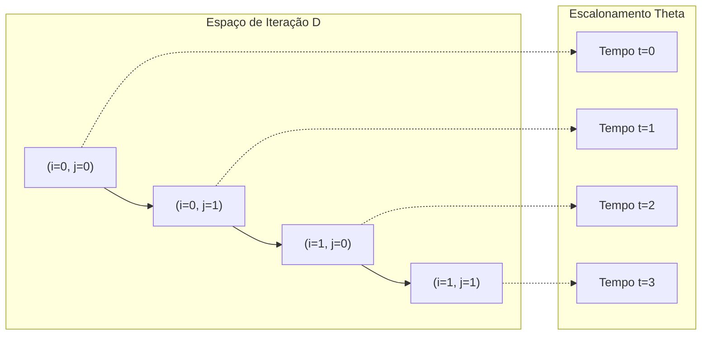
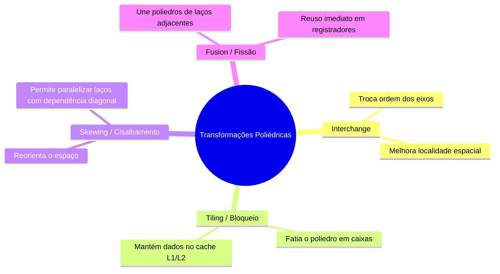
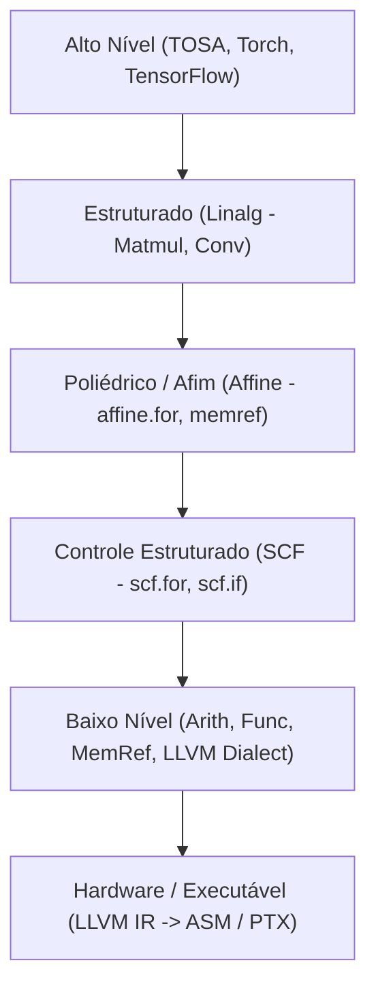
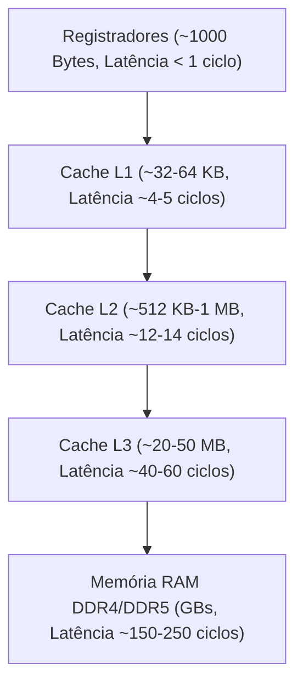

# 👨‍🏫 Masterclass Pedagógica: Compiladores, Modelo Poliédrico e MLIR

> **Autor:** Jarvis (Mentor & Professor de TCC — DCC/UFMG)  
> **Público-Alvo:** Estudantes de Graduação e Pesquisadores em Computação  
> **Objetivo:** Fornecer uma formação completa, rigorosa e intuitiva desde os primeiros princípios matemáticos até as técnicas de engenharia de ponta em compiladores modernos.

---

## 📑 Índice da Masterclass
1. [Módulo 1: O Modelo Poliédrico a partir dos Primeiros Princípios](#módulo-1-o-modelo-poliédrico-a-partir-dos-primeiros-princípios)
2. [Módulo 2: Fundamentos e Arquitetura do MLIR](#módulo-2-fundamentos-e-arquitetura-do-mlir)
3. [Módulo 3: O Dialeto MLIR Affine em Profundidade](#módulo-3-o-dialeto-mlir-affine-em-profundidade)
4. [Módulo 4: Anatomia de um Kernel — De C a MLIR e Assembly](#módulo-4-anatomia-de-um-kernel--de-c-a-mlir-e-assembly)
5. [Módulo 5: Microarquitetura, Profiling de Hardware e Modelo Roofline](#módulo-5-microarquitetura-profiling-de-hardware-e-modelo-roofline)
6. [Módulo 6: Questões de Fixação & Desafios Socráticos](#módulo-6-questões-de-fixação--desafios-socráticos)

---

# Módulo 1: O Modelo Poliédrico a partir dos Primeiros Princípios

## 1.1. Por que compiladores clássicos falham em laços aninhados?
Compiladores tradicionais (como GCC e Clang clássico) representam programas como **Árvores Sintáticas Abstratas (AST)** ou **Grafos de Fluxo de Controle (CFG)** sobre Representações Intermediárias lineares (como LLVM IR).

Considere o seguinte aninhamento de laços:
```c
for (int i = 0; i < N; i++) {
    for (int j = 0; j < N; j++) {
        A[i][j] = A[i][j] + B[i][j]; // S1
    }
}
```
No CFG, cada laço é apenas uma coleção de blocos básicos com saltos condicionais (`br i1 %cmp, label %loop, label %exit`). O compilador enxerga instruções isoladas, mas **perde a visão geométrica global do espaço de iteração**. Descobrir se o laço `i` pode ser paralelizado ou invertido com `j` exige análises complexas de *alias* e dependência que se tornam intratáveis quando há múltiplos laços e índices entrelaçados.

---

## 1.2. A Abstração Geométrica: Espaço de Iteração (Poliedro)
O **Modelo Poliédrico** (*Polyhedral Framework*) trata cada execução de uma instrução dentro de laços como um **ponto inteiro dentro de um espaço geométrico multidimensional** (um poliedro convexo $\mathcal{D} \subset \mathbb{Z}^n$).

### A Tríade Poliédrica:
Todo laço poliédrico é formalmente definido por 3 componentes:

1. **Domínio de Iteração ($\mathcal{D}_S$):**
   O conjunto de todas as iterações válidas de um comando $S$, delimitado por desigualdades afins:
   $$\mathcal{D}_S = \{ \vec{i} \in \mathbb{Z}^n \mid A\vec{i} + \vec{b} \ge \vec{0} \}$$
   *Exemplo:* Para `0 <= i < N` e `0 <= j <= i`, o domínio em $\mathbb{Z}^2$ forma um poliedro triangular.

2. **Relação de Acesso à Memória ($\mathcal{M}_S$):**
   Função afim que mapeia o vetor de iteração $\vec{i}$ para a coordenada do elemento do array:
   $$\mathcal{M}_S(\vec{i}) = M \vec{i} + \vec{m}$$
   *Exemplo:* Para `A[i + 2][j - 1]`, o acesso é:
   $$\mathcal{M}(i, j) = \begin{bmatrix} 1 & 0 \\ 0 & 1 \end{bmatrix} \begin{bmatrix} i \\ j \end{bmatrix} + \begin{bmatrix} 2 \\ -1 \end{bmatrix}$$

3. **Função de Escalonamento ($\theta_S$):**
   Mapeia o vetor de iteração $\vec{i}$ para uma data lógica de execução no tempo (ordem lexicográfica):
   $$\theta_S(\vec{i}) = T \vec{i} + \vec{t}$$



---

## 1.3. Análise Exata de Dependência de Dados
Uma dependência de dados ocorre quando duas iterações $\vec{i}_1$ e $\vec{i}_2$ acessam a mesma posição de memória e pelo menos um dos acessos é de escrita.

- **RAW (Read-After-Write / Verdadeira):** $\vec{i}_1$ escreve e $\vec{i}_2$ lê.
- **WAR (Write-After-Read / Anti-dependência):** $\vec{i}_1$ lê e $\vec{i}_2$ escreve.
- **WAW (Write-After-Write / Saída):** $\vec{i}_1$ escreve e $\vec{i}_2$ escreve.

No modelo poliédrico, a existência de dependência entre $\vec{i}_1$ e $\vec{i}_2$ equivale a encontrar uma solução inteira para o sistema:
$$\begin{cases}
\vec{i}_1 \in \mathcal{D}_{S_1}, \quad \vec{i}_2 \in \mathcal{D}_{S_2} \\
\mathcal{M}_{S_1}(\vec{i}_1) = \mathcal{M}_{S_2}(\vec{i}_2) \\
\theta_{S_1}(\vec{i}_1) \prec \theta_{S_2}(\vec{i}_2)
\end{cases}$$
Esse sistema é resolvido exatamente usando algoritmos de **Eliminação de Fourier-Motzkin**, **Algoritmo de Pip** (*Parametric Integer Programming*) ou a biblioteca **ISL** (*Integer Set Library*).

---

## 1.4. Transformações Geométricas de Laços



### O Conceito de Loop Tiling (Bloqueio de Cache):
Se uma matriz $N \times N$ for muito grande para caber na memória cache L1 (ex: $N=2048$, exigindo dezenas de megabytes), cada linha percorrida expulsa dados anteriores do cache (*cache thrashing*).  
O **Loop Tiling** divide o espaço de iteração bidimensional em pequenos blocos $B \times B$ (ex: $32 \times 32$):
```c
// Laço original
for (int i = 0; i < N; i++)
    for (int j = 0; j < N; j++)
        C[i][j] += A[i][k] * B[k][j];

// Laço após Tiling (Bloqueado)
for (int ii = 0; ii < N; ii += B)
    for (int jj = 0; jj < N; jj += B)
        for (int i = ii; i < min(ii + B, N); i++)
            for (int j = jj; j < min(jj + B, N); j++)
                C[i][j] += A[i][k] * B[k][j];
```
Com isso, todo o bloco $B \times B$ de dados permanece no cache L1 durante a computação, reduzindo o tráfego com a memória RAM em dezenas de vezes.

---

# Módulo 2: Fundamentos e Arquitetura do MLIR

## 2.1. O Problema da Representação Única do LLVM
O LLVM IR é universal, mas de nível muito baixo: ele converte matrizes em aritmética de ponteiros (`getelementptr`), laços em saltos condicionais (`br`), e operações tensoriais em instruções escalares. Quando uma matriz é convertida para ponteiros brutos, a estrutura multidimensional original é perdida, tornando quase impossível reconstruir o poliedro original.

O **MLIR (Multi-Level Intermediate Representation)** resolve isso permitindo que compiladores operem com **múltiplos níveis de abstração simultaneamente**, preservando a semântica de alto nível até que seja o momento ideal para o lowering.



---

## 2.2. Conceitos Fundamentais do MLIR

1. **Operação (`mlir::Operation`):** A unidade básica de computação no MLIR. Possui um nome qualificado (`dialeto.op_name`), operandos, atributos, tipos de retorno e regiões/blocos.
   *Exemplo:* `%res = arith.addf %a, %b : f32`
2. **Dialeto:** Um namespace fechado que agrupa tipos, atributos e operações para um domínio específico (ex: `affine`, `linalg`, `gpu`, `scf`, `llvm`).
3. **Regiões e Blocos:** Uma operação pode conter regiões fechadas contendo blocos básicos, permitindo aninhamento hierárquico direto no IR (ao contrário do LLVM IR plano).
4. **MemRef Type (`memref<1024x1024xf64>`):** Representação formal de buffers de memória multidimensionais com layout, strides e tipo de elemento, eliminando a ambiguidade de ponteiros genéricos em C.

---

# Módulo 3: O Dialeto MLIR Affine em Profundidade

O dialeto `affine` foi projetado explicitamente para implementar o **Modelo Poliédrico dentro do ecossistema MLIR**.

## 3.1. Operações Principais do Dialeto Affine
- `affine.for`: Laço estruturado cujos limites são expressões afins de constantes ou dimensões/símbolos externos.
- `affine.load`: Leitura em `memref` onde os índices são calculados via mapas afins estaticamente verificáveis.
- `affine.store`: Escrita em `memref` com restrições afins.
- `affine.if`: Condicional cujas restrições de predicado formam um conjunto inteiro (*Integer Set*).
- `affine.parallel`: Representação de laços sem dependências de iteração cruzada, diretamente mapeáveis para múltiplos núcleos ou threads de GPU.

## 3.2. Os Passes do Pipeline Poliédrico do Kiriko

| Pass MLIR | Função e Mecânica de Otimização |
| :--- | :--- |
| `-canonicalize` | Simplifica expressões constantes e remove código morto algébrico. |
| `-cse` | Eliminação de Subexpressões Comuns (*Common Subexpression Elimination*). |
| `-mem2reg` | Promove alocações de memória temporária (`memref`) para registradores SSA escalares. |
| `-affine-loop-tile=tile-size=K` | Particiona os laços afins em blocos de tamanho $K$ para localidade de cache. |
| `-affine-loop-fusion` | Funde laços afins consecutivos para manter variáveis intermediárias em registradores. |
| `-affine-loop-unroll=unroll-factor=U` | Desenrola os laços $U$ vezes para expor paralelismo no nível de instrução (ILP). |
| `-affine-scalrep` | Substitui leituras e escritas repetidas ao mesmo elemento de array em iterações consecutivas por variáveis escalares. |
| `-affine-super-vectorize` | Converte operações escalares dentro do laço afim para instruções SIMD vetoriais (`vector<4xf32>`, etc.). |

---

# Módulo 4: Anatomia de um Kernel — De C a MLIR e Assembly

Vamos analisar o kernel de multiplicação de matrizes (**GEMM**):

### 1. Código Fonte em C (PolyBench):
```c
void kernel_gemm(int ni, int nj, int nk, double alpha, double beta,
                 double C[1024][1024], double A[1024][1024], double B[1024][1024]) {
    int i, j, k;
    for (i = 0; i < ni; i++) {
        for (j = 0; j < nj; j++) {
            C[i][j] *= beta;
            for (k = 0; k < nk; k++) {
                C[i][j] += alpha * A[i][k] * B[k][j];
            }
        }
    }
}
```

### 2. Representação no Dialeto MLIR Affine (`gemm_kernel.mlir`):
```mlir
module {
  func.func @kernel_gemm(%arg0: i32, %arg1: i32, %arg2: i32,
                         %arg3: f64, %arg4: f64,
                         %C: memref<1024x1024xf64>,
                         %A: memref<1024x1024xf64>,
                         %B: memref<1024x1024xf64>) {
    %ni = arith.index_cast %arg0 : i32 to index
    %nj = arith.index_cast %arg1 : i32 to index
    %nk = arith.index_cast %arg2 : i32 to index

    affine.for %i = 0 to %ni {
      affine.for %j = 0 to %nj {
        %c_val = affine.load %C[%i, %j] : memref<1024x1024xf64>
        %c_beta = arith.mulf %c_val, %arg4 : f64
        affine.store %c_beta, %C[%i, %j] : memref<1024x1024xf64>
        affine.for %k = 0 to %nk {
          %a_val = affine.load %A[%i, %k] : memref<1024x1024xf64>
          %a_alpha = arith.mulf %arg3, %a_val : f64
          %b_val = affine.load %B[%k, %j] : memref<1024x1024xf64>
          %prod = arith.mulf %a_alpha, %b_val : f64
          %curr_c = affine.load %C[%i, %j] : memref<1024x1024xf64>
          %sum = arith.addf %curr_c, %prod : f64
          affine.store %sum, %C[%i, %j] : memref<1024x1024xf64>
        }
      }
    }
    return
  }
}
```

### 3. Código Gerado em Assembly x86-64 com Vetorização AVX2/FMA:
```assembly
.LBB0_4:                                # Loop interno vetorizado
    vmovupd   (%rdi,%rax,8), %ymm1      # Carrega 4 doubles de A (256 bits)
    vmulpd    %ymm0, %ymm1, %ymm1       # ymm1 = alpha * A[i][k..k+3]
    vfmadd231pd (%rsi,%rax,8), %ymm1, %ymm2 # ymm2 += ymm1 * B[k..k+3][j] (FMA)
    addq      $4, %rax                  # Avança 4 iterações no laço
    cmpq      %rcx, %rax
    jl        .LBB0_4
```

Observe a instrução **`vfmadd231pd`**: o compilador gerou uma instrução Fused Multiply-Add vetorial que executa **8 operações de ponto flutuante por ciclo de clock** em um único registrador YMM de 256 bits!

---

# Módulo 5: Microarquitetura, Profiling de Hardware e Modelo Roofline

## 5.1. A Pirâmide de Memória e Métricas de Desempenho



Quando um laço acessa a memória sem bloqueio de cache, as requisições sofrem *L3 misses* constantes, forçando os núcleos da CPU a ficarem ociosos (*stalls*) aguardando a RAM lenta.

## 5.2. O Modelo Roofline (Teto de Desempenho)
O **Modelo Roofline** relaciona a performance atingida ($P$, em GFLOPS/s) com a **Intensidade Aritmética** ($I$, em FLOPs/Byte transferido da memória):

$$P = \min(P_{\text{pico}}, I \times B_{\text{memória}})$$

- **Região Limitada por Memória (*Memory-Bound*):** $I < \frac{P_{\text{pico}}}{B_{\text{memória}}}$. O desempenho é ditado pela largura de banda da RAM.
- **Região Limitada por Computação (*Compute-Bound*):** $I \ge \frac{P_{\text{pico}}}{B_{\text{memória}}}$. O processador opera no limite máximo de suas unidades funcionais (ALUs/FPUs).

Transformações poliédricas como **Tiling** aumentam dramaticamente a intensidade aritmética $I$ ao reusar dados que já estão no cache L1, empurrando a aplicação da região limitada por memória para a região limitada por computação!

---

# Módulo 6: Questões de Fixação & Desafios Socráticos

Aqui estão 4 questões para reflexão e consolidação do aprendizado:

1. **Desafio 1 (Espaço de Iteração):**
   Dado o laço `for(i=0; i<N; i++) for(j=i; j<N; j++)`, desenhe mentalmente o domínio de iteração $\mathcal{D}$. Quantos pontos inteiros existem dentro deste poliedro em função de $N$?
2. **Desafio 2 (Dependência de Dados):**
   No laço `for(i=1; i<N; i++) A[i] = A[i-1] + B[i];`, qual é a distância e o tipo de dependência? É possível paralelizar esse laço diretamente sem transformações?
3. **Desafio 3 (MLIR vs LLVM):**
   Por que o pass `-affine-loop-tile` precisa ser executado **antes** do `--lower-affine` no pipeline do Kiriko?
4. **Desafio 4 (Autotuning):**
   Se o cache L1-D de uma CPU possui $32\text{ KB}$ e processamos matrizes `double` ($8\text{ bytes}$ por elemento), qual é o maior valor teórico de $B$ para o qual três matrizes $B \times B$ cabem simultaneamente no cache L1?
