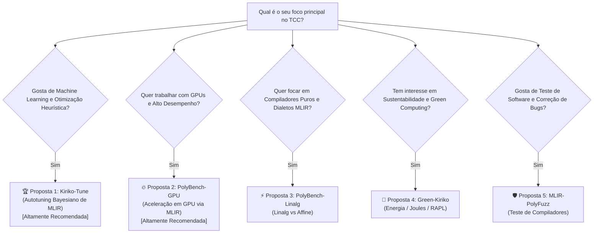

# 🚀 Plano de Ação & Matriz de Decisão para o Retorno

Bem-vindo de volta! Enquanto você esteve ausente, o **Jarvis** realizou uma análise técnica completa da base de código do **Kiriko**, do artigo do **LaC/Cadence (02/2026)** e estruturou todo o ecossistema de agentes e propostas para o seu TCC.

Este documento resume as decisões imediatas que você precisa tomar e os próximos passos práticos.

---

## 🧭 Matriz de Decisão: Escolhendo o Tema do seu TCC

Analise as 6 opções e veja qual combina mais com o seu perfil e objetivos:

### Quadro Comparativo das Propostas Recomendadas:

| Critério | 🏆 Proposta 1: Kiriko-Tune | 🔥 Proposta 2: PolyBench-GPU |
| :--- | :--- | :--- |
| **Objetivo** | Autotuning de tile size, unroll e passes MLIR | Compilação automática para CUDA via MLIR GPU |
| **Dificuldade** | Média-Alta | Alta |
| **Risco Técnico** | Baixo (infraestrutura já pronta em Python/MLIR) | Médio (requer hardware GPU NVIDIA e drivers) |
| **Impacto no Artigo** | Resolve diretamente a maior fraqueza do artigo LaC | Abre uma nova fronteira para o PolyBench-MLIR |
| **Publicação Alvo** | SBLP, CGO, CC, WSCAD | CGO, PACT, WSCAD |

---

## 📋 Checklist de Próximos Passos (Dia 1 e Semana 1)

### Fase 1: Alinhamento de Tema (Dia 1)
- [ ] Ler a análise do artigo: [`docs/01_PAPER_ANALYSIS_LAC_REPORT.md`](file:///home/mateuszaparoli/ufmg/POC/docs/01_PAPER_ANALYSIS_LAC_REPORT.md)
- [ ] Ler as propostas detalhadas: [`docs/03_THESIS_PROPOSALS.md`](file:///home/mateuszaparoli/ufmg/POC/docs/03_THESIS_PROPOSALS.md)
- [ ] Selecionar a proposta vencedora (ou pedir ao Jarvis para detalhar um híbrido).

### Fase 2: Alinhamento com Orientador (Semana 1)
- [ ] Apresentar a proposta escolhida ao orientador no DCC/UFMG (ex: Prof. Fernando Pereira / pesquisadores do LaC).
- [ ] Definir cronograma oficial de entregas do TCC 1 e TCC 2.

### Fase 3: Ambiente & Primeiros Experimentos (Semana 2)
- [ ] Configurar LLVM/MLIR 20.1 no ambiente local de desenvolvimento.
- [ ] Executar o primeiro pipeline de testes automatizado do Kiriko.
- [ ] Criar o repositório do projeto do TCC ou branch dedicada no Kiriko.

---

## 💬 Comandos Prontos para Dizer ao Jarvis

Quando estiver pronto para continuar, basta enviar uma das seguintes mensagens:

1. *"Jarvis, escolhi a **Proposta 1 (Kiriko-Tune)**. Vamos criar o plano de implementação detalhado e a arquitetura do autotuner."*
2. *"Jarvis, escolhi a **Proposta 2 (PolyBench-GPU)**. Como começamos o lowering de Affine para GPU dialect?"*
3. *"Jarvis, me dê uma aula sobre o **Módulo 1 da Masterclass** para eu entender exatamente como funciona o espaço de iteração poliédrico."*
4. *"Jarvis, vamos investigar e reproduzir o bug do kernel `symm` no MLIR."*
