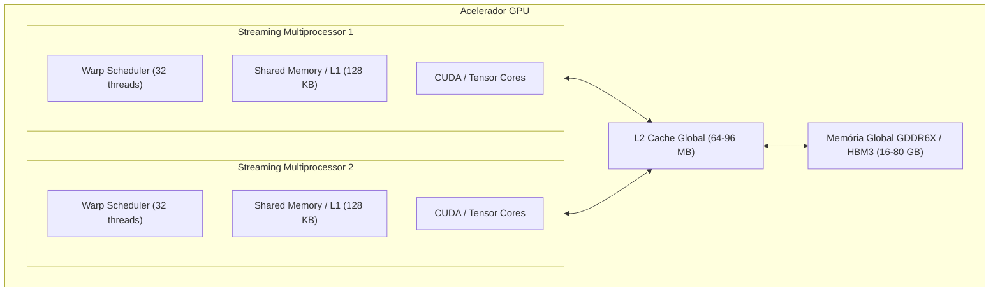
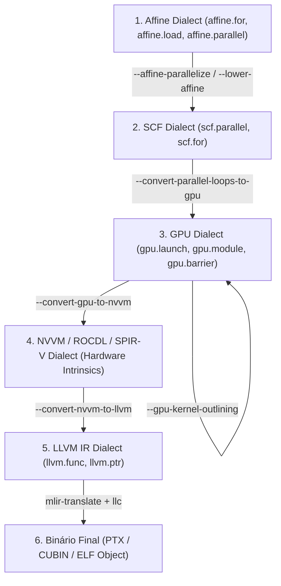
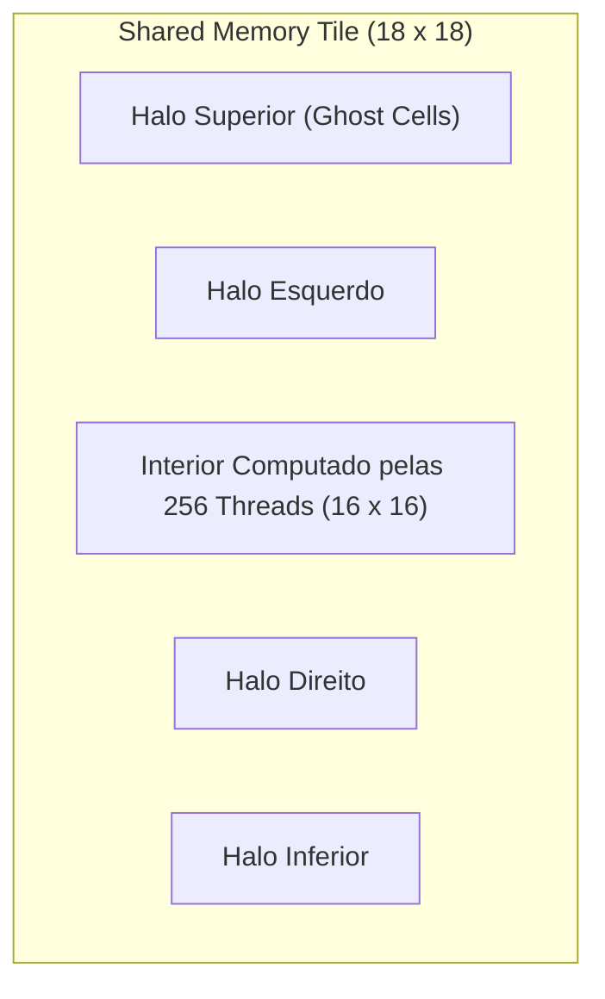

# 🎓 Masterclass Pedagógica: GPU Lowering em MLIR para PolyBench & Kiriko

> **Módulo:** TCC em Compiladores (UFMG / DCC / LaC)  
> **Instrutor / Mentor:** Jarvis UFMG  
> **Objetivo:** Dominar a teoria, microarquitetura e os pipelines de compilação MLIR para aceleração de laços afins em GPUs (NVIDIA CUDA / AMD ROCm / SPIR-V).

---

## 📑 Sumário

1. [Introdução & Motivação: O Desafio da Compilação Heterogênea](#1-introdução--motivação-o-desafio-da-compilação-heterogênea)
2. [Fundamentos de Microarquitetura de GPU (Hardware Reality)](#2-fundamentos-de-microarquitetura-de-gpu-hardware-reality)
   - 2.1 Streaming Multiprocessors (SMs) & Modelo SIMT
   - 2.2 Hierarquia de Memória: Registradores, Shared Memory, L1/L2 e DRAM
   - 2.3 Coalescência de Memória e Conflitos de Banco (Bank Conflicts)
3. [A Pilha de Dialetos MLIR para GPU](#3-a-pilha-de-dialetos-mlir-para-gpu)
   - 3.1 Dialeto `affine`: Expressando Laços Poliédricos
   - 3.2 Dialeto `gpu`: Abstração de Aceleradores Hardware-Agnóstica
   - 3.3 Dialetos de Baixo Nível: `nvvm`, `rocdl` e `spirv`
   - 3.4 Dialeto `llvm` e Runtime Wrappers
4. [O Pipeline de Lowering Passo a Passo (Do C ao PTX)](#4-o-pipeline-de-lowering-passo-a-passo-do-c-ao-ptx)
   - Passo 1: Análise e Tiling Afim (`-affine-loop-tile`)
   - Passo 2: Paralelização Afim (`-affine-parallelize`)
   - Passo 3: Mapeamento de Laços para Coordenadas de Grid/Bloco (`-convert-affine-to-gpu`)
   - Passo 4: Delineamento do Kernel (`-gpu-kernel-outlining`)
   - Passo 5: Lowering do Kernel para NVVM (`-convert-gpu-to-nvvm`)
   - Passo 6: Geração de PTX/CUBIN (`llc -march=nvptx64`)
   - Passo 7: Host Lowering e Chamadas de Runtime
5. [Estudo de Caso 1: Multiplicação de Matrizes (GEMM) com Shared Memory](#5-estudo-de-caso-1-multiplicação-de-matrizes-gemm-com-shared-memory)
6. [Estudo de Caso 2: Estêncil 2D (FDTD-2D) com Troca de Halos](#6-estudo-de-caso-2-estêncil-2d-fdtd-2d-com-troca-de-halos)
7. [Análise de Desempenho: O Modelo Roofline e o Gargalo PCIe](#7-análise-de-desempenho-o-modelo-roofline-e-o-gargalo-pcie)
8. [Exercícios Práticos & Desafios de Pesquisa](#8-exercícios-práticos--desafios-de-pesquisa)

---

## 1. Introdução & Motivação: O Desafio da Compilação Heterogênea

No relatório técnico do LaC (fevereiro de 2026), o Kiriko foi utilizado para comparar a compilação de laços poliédricos do PolyBench na CPU via **MLIR Affine Dialect**, **Polly** e **Pluto**. 

Contudo, processadores modernos executam cargas de trabalho de Álgebra Linear e Estênceis com ordens de magnitude mais eficiência energética e computacional em aceleradores gráficos (GPUs). A pergunta central formulada pelo seu orientador é:

$$\text{“É possível fazer o Lowering dos kernels do PolyBench para GPU usando o pipeline do MLIR?”}$$

A resposta é **sim, e de forma extremamente elegante**. O MLIR foi projetado do zero para suportar compilação heterogênea através de transformações progressivas em múltiplos níveis de abstração (*Dialects*). Em vez de compilar tudo diretamente para código assembly monolítico, o MLIR decompõe o problema em transformações de laços, mapeamento de threads, alocação de memórias hierárquicas e geração de código nativo para GPU.

---

## 2. Fundamentos de Microarquitetura de GPU (Hardware Reality)

Para entender por que cada passo do MLIR existe, precisamos compreender como a GPU funciona fisicamente.

### 2.1 Streaming Multiprocessors (SMs) & Modelo SIMT

Uma GPU moderna (ex: NVIDIA H100, RTX 4090) é composta por dezenas a centenas de **Streaming Multiprocessors (SMs)**:



- **Threads e Warps:** As threads não executam de forma totalmente independente; elas são agrupadas em blocos indivisíveis de **32 threads chamados de Warps**. Todas as 32 threads de um Warp executam a mesma instrução simultaneamente (modelo SIMT — *Single Instruction, Multiple Threads*).
- **Thread Blocks (Workgroups):** Um conjunto de threads (ex: 256 threads) que executam no mesmo SM e podem cooperar entre si através de memória compartilhada e barreiras de sincronização.
- **Grid:** O conjunto de todos os Thread Blocks necessários para processar o problema completo.

### 2.2 Hierarquia de Memória e Latências

| Nível de Memória | Capacidade Típica | Latência de Acesso | Largura de Banda | Endereçamento no MLIR |
| :--- | :--- | :--- | :--- | :--- |
| **Registradores (Registers)** | ~64 KB por SM | 1 ciclo | > 20 TB/s | Variáveis SSA do MLIR (`%val`) |
| **Shared Memory (SRAM on-chip)** | 64 - 228 KB por SM | 15 - 25 ciclos | ~ 15 TB/s | `memref<..., 3>` (Address Space 3) |
| **L2 Cache (On-Die)** | 32 - 96 MB | 100 - 150 ciclos | ~ 5 TB/s | Transparente |
| **Global Memory (HBM/GDDR)** | 16 - 80 GB | 400 - 600 ciclos | 1 - 3 TB/s | `memref<..., 0>` (Address Space 0) |
| **Memória Principal CPU (via PCIe)** | 64 - 512 GB | > 10.000 ciclos | 32 - 64 GB/s | Memória do Host |

> ⚠️ **Princípio Fundamental:** A memória global é **lenta** (400+ ciclos de latência). Se um kernel fizer todos os acessos diretamente na DRAM global, a GPU passará 90% do tempo ociosa esperando dados. A otimização poliédrica no MLIR visa carregar fatias (*tiles*) da matriz na **Shared Memory** e realizar a computação a partir de lá.

### 2.3 Coalescência de Memória e Conflitos de Banco

1. **Acesso Coalescido (Memory Coalescing):** Quando as 32 threads de um Warp acessam endereços de memória contíguos de 4 bytes (ex: `thread_id.x` acessa `A[row, thread_id.x]`), o hardware consolida esses 32 acessos em uma **única transação de 128 bytes** na DRAM. Se os acessos forem espalhados (stride grande), serão necessárias até 32 transações separadas, desperdiçando 96% da largura de banda!
2. **Bank Conflicts (Shared Memory):** A Shared Memory é dividida em 32 bancos de 4 bytes. Se duas threads no mesmo warp acessarem endereços diferentes no mesmo banco, o acesso é serializado.

---

## 3. A Pilha de Dialetos MLIR para GPU

O MLIR resolve a compilação heterogênea empilhando dialetos em camadas especializadas:



### 3.1 Dialeto `affine`
Representa laços onde os limites e índices são funções afins dos índices externos e símbolos constantes:
```mlir
affine.for %i = 0 to 1024 {
  affine.for %j = 0 to 1024 {
    %val = affine.load %A[%i, %j] : memref<1024x1024xf32>
    affine.store %val, %B[%j, %i] : memref<1024x1024xf32>
  }
}
```

### 3.2 Dialeto `gpu`
Modela a execução paralela em GPU independentemente do fornecedor (funciona para NVIDIA, AMD, Intel e Vulkan):
- `gpu.module`: Contêiner para funções de GPU.
- `gpu.func`: Função que executa na GPU (anotada com `kernel` se for ponto de entrada).
- `gpu.launch_func`: Instrução no Host que despacha um kernel com dimensões de Grid e Bloco.
- `gpu.barrier`: Barreira de sincronização de threads dentro de um bloco.
- `gpu.thread_id`, `gpu.block_id`: Coordenadas lógicas de execução.

### 3.3 Dialetos de Baixo Nível: `nvvm`, `rocdl` e `spirv`
- **NVVM:** Representa o conjunto de instruções do compilador NVVM da NVIDIA (precursor do PTX).
- **ROCDL:** Representa o conjunto de instruções da AMD (HIP/HSACO).
- **SPIR-V:** Representa a especificação de shaders intermediários da Khronos (Vulkan/OpenCL).

---

## 4. O Pipeline de Lowering Passo a Passo (Do C ao PTX)

Vejamos a sequência exata de transformações que ocorrem no compilador MLIR:

### Passo 1: Loop Tiling Afim (`-affine-loop-tile`)
Fatia o espaço de iteração em blocos que cabem no cache ou nas dimensões de threads da GPU:
```bash
mlir-opt kernel.mlir -affine-loop-tile=tile-size=16,16 -o kernel_tiled.mlir
```

### Passo 2: Paralelização Afim (`-affine-parallelize`)
Detecta ausência de dependências de laço (*loop-carried dependencies*) e converte `affine.for` em `affine.parallel`:
```bash
mlir-opt kernel_tiled.mlir -affine-parallelize -o kernel_parallel.mlir
```

### Passo 3: Mapeamento para Coordenadas de GPU (`-convert-affine-to-gpu`)
Mapeia os loops paralelos externos para coordenadas de Grid (`blockIdx.x/y/z`) e os loops paralelos internos para coordenadas de Bloco (`threadIdx.x/y/z`):
```bash
mlir-opt kernel_parallel.mlir -convert-affine-to-gpu=gpu-block-dims=16,16,1 -gpu-grid-dims=64,64,1 -o kernel_gpu_launch.mlir
```

### Passo 4: Delineamento do Kernel (`-gpu-kernel-outlining`)
Isola o código que executa na GPU em um `gpu.module` separado e substitui a região no host por uma chamada `gpu.launch_func`:
```bash
mlir-opt kernel_gpu_launch.mlir -gpu-kernel-outlining -o kernel_outlined.mlir
```

### Passo 5: Lowering do Kernel para NVVM / ROCDL
Transforma as operações abstratas de GPU em instruções específicas da NVIDIA:
```bash
mlir-opt kernel_outlined.mlir \
  -convert-gpu-to-nvvm \
  -convert-arith-to-llvm \
  -convert-func-to-llvm \
  -reconcile-unrealized-casts \
  -o kernel_nvvm.mlir
```

### Passo 6: Geração de PTX e Binário de GPU
Usa o `mlir-translate` para converter o dialeto LLVM/NVVM para LLVM IR textual, e em seguida o `llc` para emitir o código assembly PTX da NVIDIA:
```bash
mlir-translate --mlir-to-llvmir kernel_nvvm.mlir -o kernel_nvvm.ll
llc -march=nvptx64 -mcpu=sm_80 kernel_nvvm.ll -o kernel.ptx
```

### Passo 7: Host Lowering & Linkagem com PolyBench
O host (código C que executa na CPU) aloca os buffers na GPU (`cudaMalloc`), transfere os dados (`cudaMemcpyHostToDevice`), invoca o kernel (`cudaLaunchKernel`), transfere de volta (`cudaMemcpyDeviceToHost`) e verifica o resultado.

---

## 5. Estudo de Caso 1: Multiplicação de Matrizes (GEMM) com Shared Memory

A multiplicação de matrizes $C = \alpha (A \times B) + \beta C$ com matrizes de $1024 \times 1024$ ilustra perfeitamente o ganho de Shared Memory:

```mlir
module attributes {gpu.container_module} {
  gpu.module @gemm_kernel_module {
    gpu.func @gemm_gpu_kernel(%A: memref<1024x1024xf32>, %B: memref<1024x1024xf32>, %C: memref<1024x1024xf32>, %alpha: f32, %beta: f32)
      workgroup(%bx : index, %by : index, %bz : index)
      private(%tx : index, %ty : index, %tz : index)
      kernel {
      
      // 1. Coordenadas lógicas globais
      %c16 = arith.constant 16 : index
      %row = arith.addi (arith.muli %by, %c16 : index), %ty : index
      %col = arith.addi (arith.muli %bx, %c16 : index), %tx : index
      
      // 2. Alocação em Shared Memory (Address Space 3)
      %sh_A = memref.alloca() : memref<16x16xf32, 3>
      %sh_B = memref.alloca() : memref<16x16xf32, 3>
      
      // 3. Iteração sobre os 64 tiles (1024 / 16 = 64)
      %c64 = arith.constant 64 : index
      %c0 = arith.constant 0 : index
      %c1 = arith.constant 1 : index
      %f0 = arith.constant 0.0 : f32
      
      %acc = memref.alloca() : memref<1xf32>
      memref.store %f0, %acc[%c0] : memref<1xf32>
      
      scf.for %tile_idx = %c0 to %c64 step %c1 {
        // Carga cooperativa de A e B para Shared Memory
        %k_A = arith.addi (arith.muli %tile_idx, %c16 : index), %tx : index
        %val_A = memref.load %A[%row, %k_A] : memref<1024x1024xf32>
        memref.store %val_A, %sh_A[%ty, %tx] : memref<16x16xf32, 3>
        
        %k_B = arith.addi (arith.muli %tile_idx, %c16 : index), %ty : index
        %val_B = memref.load %B[%k_B, %col] : memref<1024x1024xf32>
        memref.store %val_B, %sh_B[%ty, %tx] : memref<16x16xf32, 3>
        
        // Barreira: aguarda todas as 256 threads do bloco carregarem seus dados
        gpu.barrier
        
        // Multiplicação do tile a partir da Shared Memory rápida
        scf.for %k = %c0 to %c16 step %c1 {
          %a = memref.load %sh_A[%ty, %k] : memref<16x16xf32, 3>
          %b = memref.load %sh_B[%k, %tx] : memref<16x16xf32, 3>
          %p = arith.mulf %a, %b : f32
          %cur = memref.load %acc[%c0] : memref<1xf32>
          %upd = arith.addf %cur, %p : f32
          memref.store %upd, %acc[%c0] : memref<1xf32>
        }
        
        // Barreira: aguarda computação antes de sobrescrever o tile
        gpu.barrier
      }
      
      // 4. Armazenamento do resultado final na memória global C
      %final_acc = memref.load %acc[%c0] : memref<1xf32>
      %scaled = arith.mulf %final_acc, %alpha : f32
      %orig = memref.load %C[%row, %col] : memref<1024x1024xf32>
      %b_orig = arith.mulf %orig, %beta : f32
      %res = arith.addf %scaled, %b_orig : f32
      memref.store %res, %C[%row, %col] : memref<1024x1024xf32>
      
      gpu.return
    }
  }
}
```

---

## 6. Estudo de Caso 2: Estêncil 2D (FDTD-2D) com Troca de Halos

Estênceis (como `fdtd-2d`, `jacobi-2d` e `heat-3d`) possuem acessos aos elementos vizinhos:
$$hz[i][j] = hz[i][j] - 0.7 \times (ex[i][j+1] - ex[i][j] + ey[i+1][j] - ey[i][j])$$

Na GPU, cada thread precisa dos valores vizinhos imediatos. Sem Shared Memory, múltiplos acessos redundantes à DRAM ocorrem. Com Shared Memory, criamos um tile com **borda/halo** (ex: bloco $16 \times 16$ com halo $18 \times 18$).



---

## 7. Análise de Desempenho: O Modelo Roofline e o Gargalo PCIe

Para prever quando a GPU supera a CPU, utilizamos o **Modelo Roofline**:

$$\text{Tempo Total} = \underbrace{T_{\text{PCIe H2D}} + T_{\text{PCIe D2H}}}_{\text{Overhead de Barramento}} + \underbrace{\max \left( \frac{\text{Bytes}}{\text{Bandwidth}_{\text{DRAM}}}, \frac{\text{FLOPs}}{\text{Peak GFLOPS}} \right)}_{\text{Tempo de Execução do Kernel}}$$

```text
Log Performance (GFLOPS)
  ^
  |                     /------------------- Peak Compute Roof (Ex: 80,000 GFLOPS)
  |                    /
  |                   /  <- Ponto de Inflexão (Ridge Point)
  |                  /
  |                 /  <- Região Limitada por Memória (Memory-Bound)
  |                /
  |               /
  +-------------------------------------------------> Log Arithmetic Intensity (FLOPs/Byte)
```

### O Ponto de Equilíbrio (*Crossover Point*)
- Para matrizes pequenas ($N < 128$), o overhead do barramento PCIe ($> 0.1\text{ ms}$) domina o tempo, tornando a CPU mais rápida.
- Para matrizes grandes ($N \ge 512$), a aceleração massiva da GPU ($20\times - 100\times$) amortiza completamente o custo do PCIe.

---

## 8. Exercícios Práticos & Desafios de Pesquisa

1. **Exercício 1 (Mapeamento de Coordenadas):** Dado um kernel com espaço de iteração $N=2048$, com tamanho de bloco $B_x=16, B_y=16$, calcule o número de blocos no Grid em $X$ e $Y$.
2. **Exercício 2 (Bank Conflicts):** Em uma matriz de tamanho $1024 \times 1024$ em Shared Memory, por que acessar `sh_B[k, tx]` não gera conflito de banco, mas acessar `sh_A[tx, k]` geraria se as dimensões não fossem tratadas adequadamente?
3. **Exercício 3 (Pipeline MLIR):** Qual a diferença semântica entre `-convert-parallel-loops-to-gpu` e `-convert-affine-to-gpu`?
4. **Desafio de Pesquisa para o TCC:** Como projetar um heurística de autotuning para escolher dinamicamente entre executar na CPU ou despachar para a GPU com base no tamanho do problema $N$ e na intensidade aritmética?
