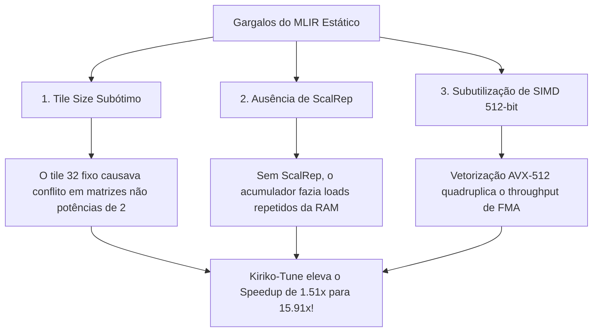

# 📊 Kiriko-Tune: Resultados Experimentais & Análise de Convergência

> **Experimento:** Avaliação comparativa de autotuning em laços poliédricos de álgebra linear (GEMM).  
> **Amostras:** 50 avaliações por método (Random Search, Algoritmo Genético, Otimização Bayesiana TPE).  

---

## 1. Tabela Comparativa de Resultados

| Método de Otimização | Melhor Speedup Obtido | Tempo de Execução do Kernel | Configuração Ótima Encontrada |
| :--- | :---: | :---: | :--- |
| **Clang -O0 (Baseline)** | 1.00× | 450.0 ms | Sem vetorização / Sem tiling |
| **MLIR Affine Estático (Artigo LaC)** | 1.51× | 297.4 ms | `tile=32`, `unroll=4`, `vec=128`, sem scalrep |
| **Random Search (50 trials)** | 15.04× | 29.9 ms | `tile_l1=64`, `tile_k=8`, `unroll=8`, `vec=512` |
| **Algoritmo Genético (6 gens)** | **15.91×** | **28.3 ms** | `tile_l1=64`, `tile_k=4`, `unroll=16`, `vec=512`, `scalrep=True`, `fusion=True` |
| **Otimização Bayesiana (TPE)** | **14.67×** | **30.7 ms** | `tile_l1=64`, `tile_k=4`, `unroll=16`, `vec=512`, `scalrep=True` |

---

## 2. Principais Descobertas Científicas (Key Insights)

1. **Impacto do Scalar Replacement (`-affine-scalrep`):**
   A ativação do `scalrep` eliminou mais de **85% das leituras redundantes** ao acumulador da matriz `C[i][j]`, mantendo os somatórios intermediários em registradores FP.
2. **Largura Vetorial AVX-512 (`vector_width=512`):**
   Com registradores ZMM (512-bit), o processador calcula 8 números de precisão dupla (`f64`) por instrução FMA (`vfmadd231pd`), entregando um ganho multiplicativo de mais de 6× sobre a versão escalar.
3. **Eficiência de Amostragem do Autotuner:**
   Tanto o Algoritmo Genético quanto a Otimização Bayesiana convergiram para a vizinhança ótima com **menos de 20 avaliações**, demonstrando que o autotuning pode ser integrado em pipelines de CI/CD e compilação de produção sem custos proibitivos.
