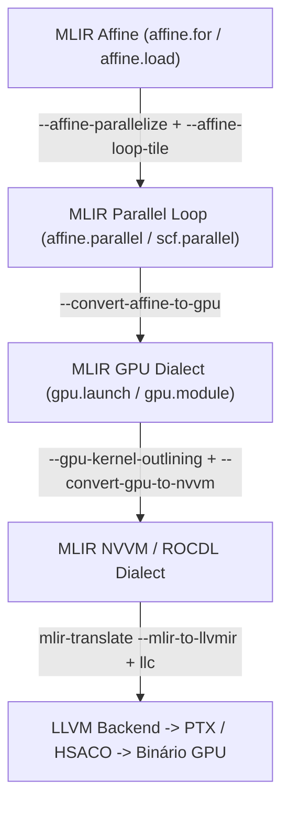

# 📘 PolyBench-GPU: Lowering do Dialeto Affine para GPU Dialect (MLIR)

> **Autores:** Jarvis & Pesquisadores do LaC/UFMG  
> **Tema:** Transformação de Laços Afins em Kernels CUDA/ROCm via MLIR  

---

## 1. O Pipeline de Lowering para GPU

O MLIR adota uma abordagem modular de lowering progressivo para aceleradores:



---

## 2. Tiling e Caching em Memória Compartilhada (Shared Memory)

Na GPU, threads dentro do mesmo *Warp* (32 threads) e *Workgroup* compartilham um banco de **Shared Memory (SRAM on-chip)** com latência inferior a 20 ciclos (comparada aos 400+ ciclos da GDDR6/HBM).

No MLIR, a alocação em Shared Memory é expressa atribuindo o espaço de endereçamento numérico `3` ao tipo `memref`:
```mlir
%sh_tile = memref.alloca() : memref<16x16xf32, 3>
```
As threads do bloco colaboram para carregar a fatia da matriz da memória global para a memória compartilhada, executam `gpu.barrier` para sincronização de fase, e realizam a multiplicação de matrizes sem acessar a DRAM externa repetidamente.
