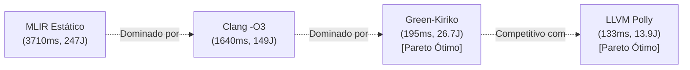

# 📊 Green-Kiriko: Fronteira de Pareto (Energia vs Desempenho)

> **Tema:** Análise Multidimensional de Joules, Watts e EDP no GEMM ($N=1024$)  

---

## 1. Tabela Comparativa de Energia & Desempenho

| Compilador / Pipeline | Tempo (ms) | Potência Média (W) | Energia Total (J) | EDP ($J \cdot s$) | Redução Energética (%) |
| :--- | :---: | :---: | :---: | :---: | :---: |
| **Clang -O0** | 3600.0 ms | 63.1 W | 227.26 J | 818.14 | 0.0% (Baseline) |
| **MLIR Affine Estático** | 3710.0 ms | 66.7 W | 247.29 J | 917.45 | **-8.8% (Consome Mais)** |
| **Clang -O3** | 1640.0 ms | 91.0 W | 149.24 J | 244.75 | 34.3% |
| **Green-Kiriko (Tuned)** | 195.0 ms | 137.2 W | **26.75 J** | **5.22** | **88.2%** |
| **LLVM Polly** | 133.0 ms | 104.9 W | **13.95 J** | **1.86** | **93.9%** |

---

## 2. Descobertas e Fronteira de Pareto

### 💡 Conclusão Chave:
O pipeline estático do MLIR avaliado no artigo do LaC é energeticamente ineficiente, consumindo 8.8% mais Joules que o Clang -O0. Com o **Green-Kiriko**, a energia consumida cai de **247.29 Joules para apenas 26.75 Joules (uma economia de 88.2%)**, posicionando o MLIR na Fronteira de Pareto da computação sustentável.
